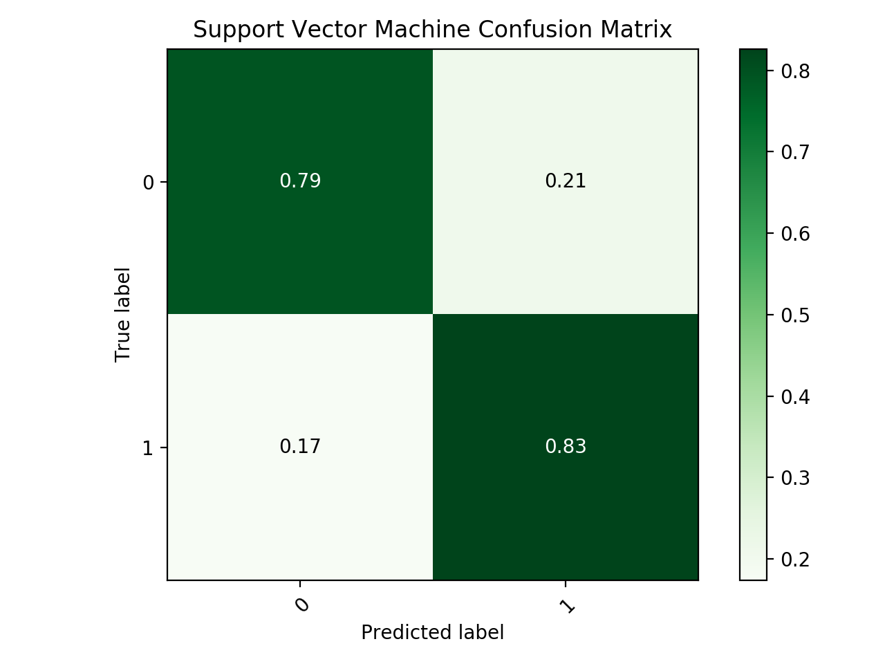
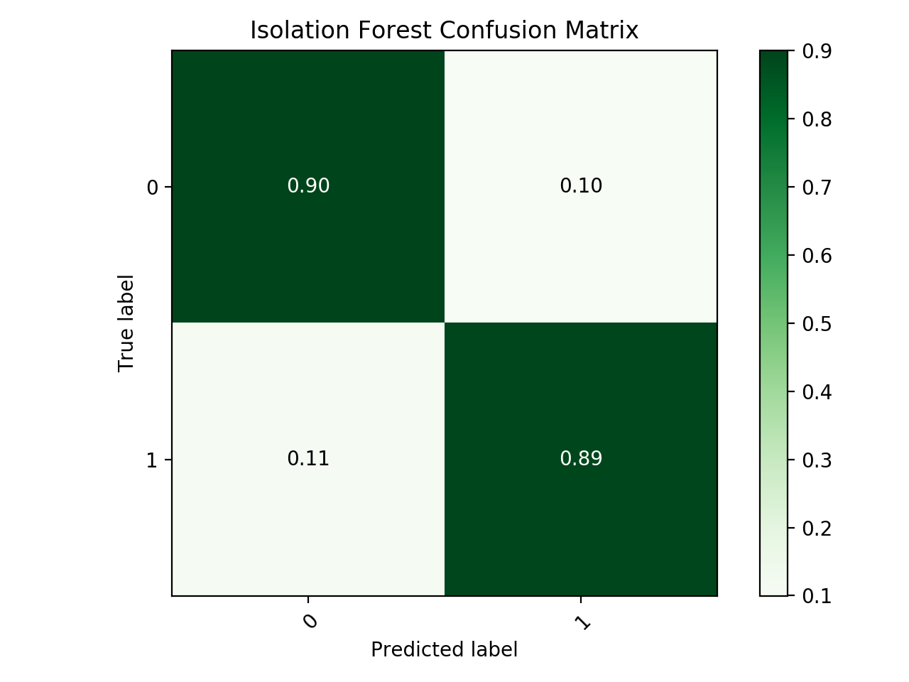

# Credit Card Fraud Detection with undersampling 

Approach to detect anomalies within a large dataset of credit card transactions.
As in most cases with anomaly detection, the positive cases are highly skewed against. This repo aims to employ several classification techniques with the addition of undersampling from the pool of the dataset.

### Study Reason:

The traditional tools of anomaly detection (for this case the isolation forest) will be benchmarked against undersample trained traditional classifiers. 

### Considered Models:

- Logistic Regression
- Multilayer Perceptron
- Support Vector Classifiers

All models' hyperparameters were picked via Recall Performance of their respective random test set.

### The data

Data contains 30 Dimensions of anonymized attributes vs one class attribute

Data points that are normal: 284315
Data points that are abnormal (anomaly/positive): 492

### Split approach 

In order to handicap the selection process, hyperparameters for the models were chosen by sampling 200 negative and 200 positive data samples (Isolation Forest is excluded from this step). 

### Evaluation

The evaluation is done by running the trained models on the remaining 284115 negative and 292. 
Metrics for evaluation:

- Recall and Precision will be the main metric 

### Findings

Confusion Matrix for the top two performing undersampling models (Linear SVM and Logistic Regression) and the benchmark Isolation Forest model can be found below.

As true positive detection is vital to this exercise it is also important to mitigate the false positives to avoid raising flags on ordinary transactions. The important point to see here is that for this outlier detection problem, the simpler logistic regression model generalized better under undersampling conditions. Let us take the second place performing classifier, the SVM, to compare.

According to the script, the best logistic regression parameters were: (C value 0.001 | Regularizer l2)
According to the script, the best SVM parameters were: (Kernel sigmoid | degree 12 | C 20)

One reason for logistic regression's superiority can be that as it is a simpler model, under low training data situations (such as undersampling) it would generalize better than a complicated model like the SVM or the MLP. A second possible reason could be the following;

The SVM model generally speaking optimizes the hinge loss whereas the logistic regression solves for the logistic loss. This difference becomes important when one takes in to account that the divergence of the logistic loss is faster than the hinge loss. This allows the logistic classifier to be more sensitive to outliers, in general, making it achieve a 97% accuracy when identifying the positive class in the highly skewed test dataset. The benchmark isolation forest algorithm could only classify 89% of the positives correctly.

The trade-off here is the false positive count. Looking at the confusion matrices, we see that the Isolation forest algorithm did a very decent job when identifying the negative cases. The Logistic Regression lacks this performance when compared with the anomaly detection algorithm. 

As this is an anomaly detection problem, every positive case will have different real-world stakes. Given that the cost of one missed anomaly outweighs the cost of around (roughly speaking) 10000 false calls, the undersample trained logistic regression is more of a better model than the rest. If not, the classic anomaly detection algorithm of Isolation Forest could be considered superior. 

note: these models could be adjusted and fine-tuned further for slightly better performance 

-end-
