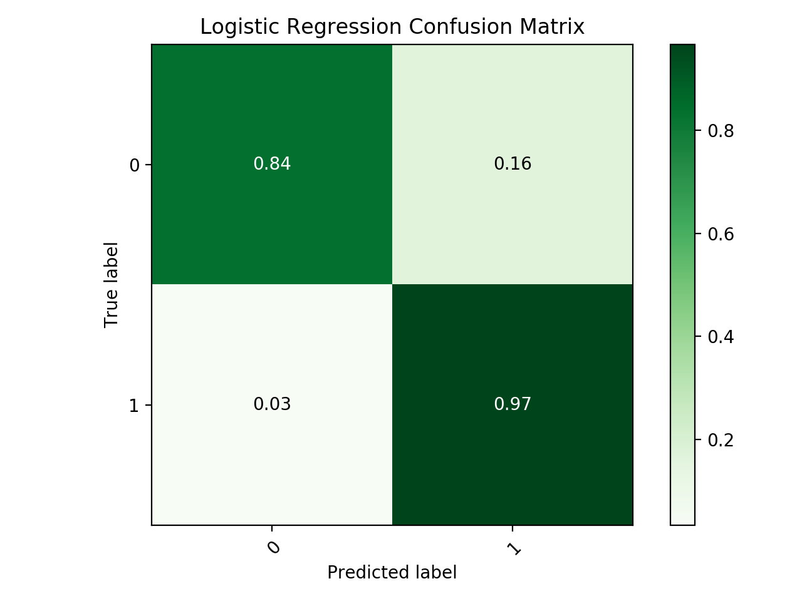

# Credit Card Fraud Detection with undersampling 

Approach to detect anomalies within a large dataset of credit card transactions.
As in most cases with anomaly detection, the positive cases are highly skewed against. This repo aims to employ several classification techniques with the addition of undersampling from the pool of the dataset.

### Study Reason:

The traditional tools of anomaly detection (for this case the isolation forest) will be bench marked against undersample trained traditional classifiers. 

### Considered Models:

- Logistic Regression
- Multilayer Perceptron
- Support Vector Classifiers

All models' hyperparameters were picked via Recall Performence of their respective random test set.

### The data

Data contains 30 Dimentions of anonimized attributes vs one class attribute

Data points that are normal: 284315
Data points that are abnormal (anomaly/positive): 492

### Split approach 

In order to handicap the selection process, hyperparameters for the models were chosen by sampling 200 negative and 200 positive data samples (Isolation Forest is excluded from this step). 

### Evaluation

The evaluation is done by running the trained models on the remaining 284115 negative and 292. 
Metrics for evaluation:

- Recall will be the main metric 
- Precision will be a secondary metric

### Findings

Confusion Matrix for the top two performing undersampling models (Linear SVM and Logistic Regression) and the benchmark Isolation Forest model can be found below.

